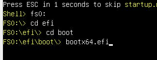
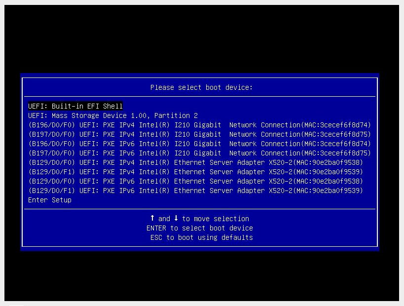

# headless-ipmi-reset

Have you ever been in the situation where you have acquired server hardware and you're are not sure what's the BMC (IPMI/iDRAC/iLO) credentials to log in and install an operating system are, and you don't have a computer screen handy (with the applicable cable/port, normally VGA...) or a image to boot and reset the password/LAN settings by hand?

Well this is the bootable ISO for you!

headless-ipmi-reset is a small (70MB) bootable ISO that you can put on to a USB stick and boot a server with and it will:

1. Change all LAN channels to use DHCP
1. Disable VLANs on all LAN channels
1. Setup a user with "admin"/"N0WReset!"
1. Flash the locator LED to indicate that is has finished

## Tested machines

* Supermicro H12
* Supermicro H13
* Supermicro X11
* Supermicro X10
* Supermicro X9

The image only works with UEFI installations, all systems that sane people would still want to use will almost certainly have this enabled.

## Recommended Usage

Go to the releases page and download the most recent "headless-ipmi-reset-x86-64.iso" and write it directly to a USB stick, on Linux/Mac you will probably want to use something like `dd`, on windows you can refer to many existing guides for flashing raspberry pi images to sd cards.

Remove all storage drives from the machine, this will prevent the server from booting (or attempting to) from any of the existing operating systems already installed.

Attach the USB drive (ideally to a USB 2 port if you have them, they just tend to work better with UEFI firmware in my experience)

Wait for the machine to POST and keep an eye on the identify/UID light, if you have a slow USB stick it might take up to two minutes for it to work (excluding the time that it takes for your machine to actually POST, you will probably be able to hear when the post is finished because the fans will spin down)

Wait for the identify/UID light to turn on (see below for examples)

<video src="assets/H12-uid.mp4"></video>

<video src="assets/X9-uid.mp4"></video>

When the identify/UID light is lit up (and it will only stay lit up for 15 seconds), you can shut the server down and connect the management port. It should then DHCP. You should then be able to log in (either using ipmitool or the web interface with "admin"/"N0WReset!")

Please make sure to change the password after running this utility and regaining control of your BMC

## Debugging when it doesn't work

There are few reasons why this ISO may not work for you, we will start with the most common

### EFI Shell starts before UEFI booting 

It may turn out that the EFI shell starts before the system will go on boot from a USB device, if this is the case you may want to wait for a while and then try and enter the following commands (while blind) using a USB keyboard:

Once bootx64.efi is started the system automatically drive itself

### The Boot Menu is needed

You may need to press F11 during boot, and (while blind) find the USB stick, on most system firmwares it is the 2nd option like so:

### UEFI is not enabled/supported

There is no solution here for this. You will have to go and find a screen and another boot ISO to reset the BMC

## Building from scratch

This project is based on buildroot, you should be able to get away with just being able to run "make", assuming that you have a basic set of compilers it will download and compile all necessary tooling to build a ISO.

Once build the ISO will be in `./buildroot/output/images/boot-xorriso.iso`

This project is based off of https://github.com/afbjorklund/minimal-buildroot
